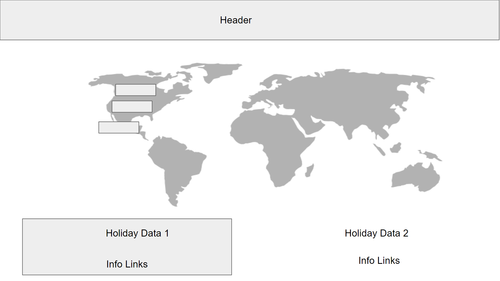

# Holiday-History-Map

## Description
As borders open up and traveling restriction are lifted, you may be thinking about planning your next vacation. Use Holiday History Map app to search the United States holiday dates in 2022 to see when you can buy plane tickets for your trip. 

Then search for the country you are traveling to and learn about the local holidays that may be happening while you are there. This app helps educate yourself on local customs and history, AND helps you plan your next vaction based on your local holidays.

### Links
Deployed at: https://robyng.github.io/Holiday-History-Map/

Reposistory at: https://github.com/robyng/Holiday-History-Map 

### Technologies Used
* Bulma CSS Framework
* HTML and Javascript
* Fetch API
* API's from:
  * Public Holiday by API Guy
https://rapidapi.com/theapiguy/api/public-holiday/ 
  * Youtube v3 by ytdlfree
https://rapidapi.com/ytdlfree/api/youtube-v31/ 

### Screenshot

### Wireframe Desktop

#### Colors 

Orange #883808

Black #040404

Brown #61371b

Grey #6a5a5c
